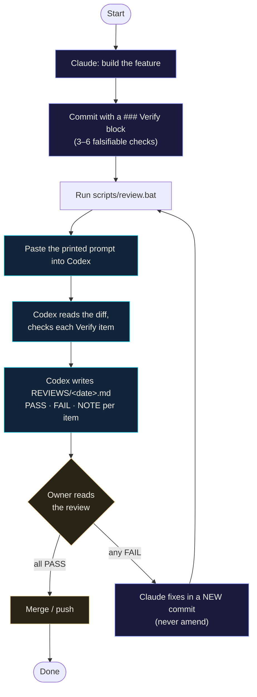
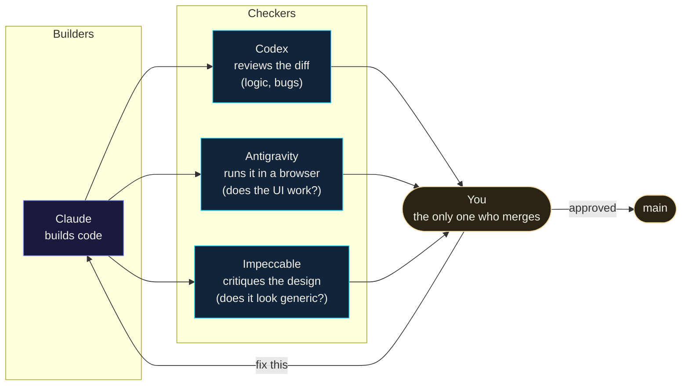
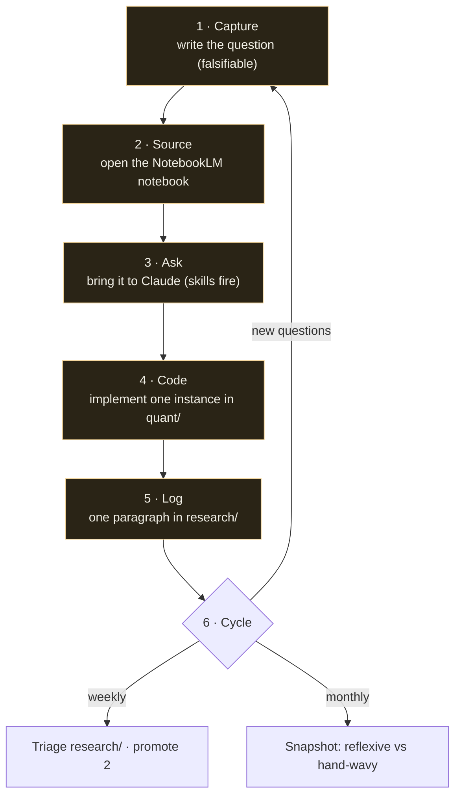
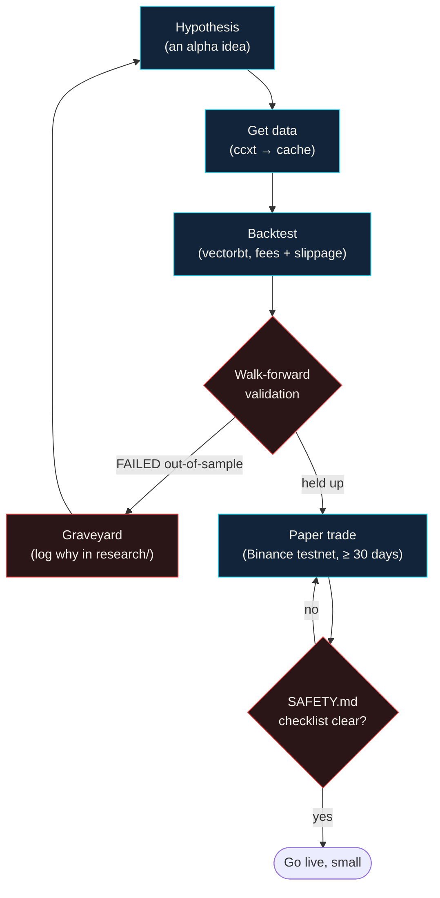

# Workflow — the maps

These diagrams are **Mermaid**: plain text that AI agents read and edit like
code, and that renders to a visual flowchart for humans. GitHub draws them
automatically below. A styled visual version lives at `demos/workflow.html`.

When the workflow changes, edit the Mermaid text here — both the human picture
and the AI's understanding update from the same source.

---

## 1. The Handshake — how code ships safely

Claude builds, Codex checks, you decide. Nothing reaches `main` without you.

**Skip the handshake** for: typos, docs, comment-only edits, hotfix one-liners.
**Always run it** for: alpha logic, money handling, auth, data sync, security.

---

## 2. The agent stack — who does what

Four specialists, one decider. Each catches what the others miss.

| Agent | Superpower | Blind spot it fills |
|-------|------------|---------------------|
| **Claude** | builds, reasons | — (the builder) |
| **Codex** | reads code diffs | logic bugs, look-ahead bias, data races |
| **Antigravity** | drives a real browser | "does the button actually work?" |
| **Impeccable** | design expertise | "this looks AI-generated / generic" |
| **You** | judgment + authority | decides what's contextually right |

---

## 3. The study flow — turning curiosity into competence

One loop, run daily. Each pass is ~45 minutes.

---

## 4. Quant research — from idea to (maybe) trading

Nothing goes live until it survives honest validation.

---

## Editing these

- Change the Mermaid text → the diagram and the AI's mental model update together.
- Preview locally: paste a block into <https://mermaid.live>, or open `demos/workflow.html`.
- GitHub renders these inline automatically on this page.
